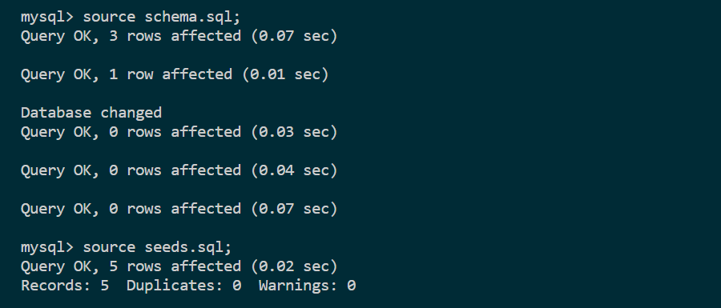
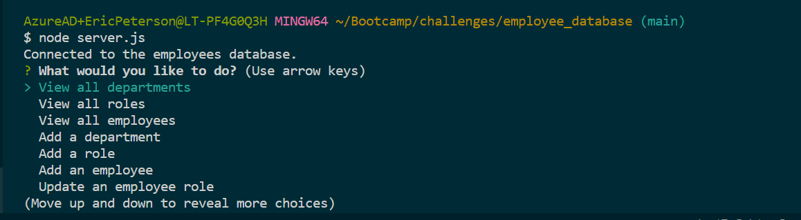
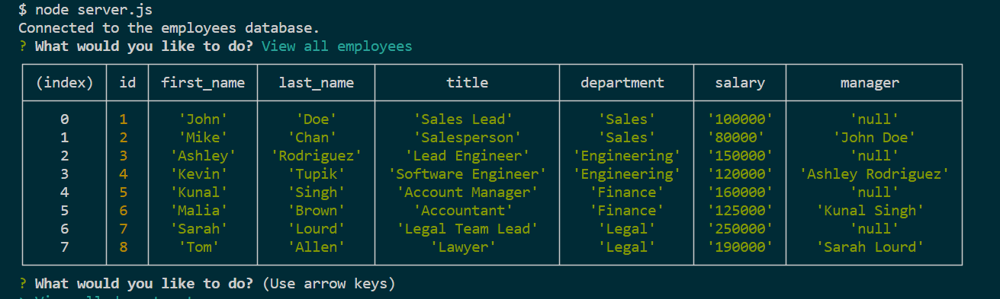

# Employee Database

## Description

I built this project to utilize my new skills with SQL, specifically with mySQL. I wanted to utilize the different SQL functions that I've learned thus far; SELECT, INSERT, and UPDATE. Additionally, I practiced my skills with creating a new database, defining new tables, and seeding data into this framework. Finally, I continued my practice with the inquirer.js package. With this project I learned how to make a dynamic list within an inquirer question by utilzing a mySQL query, and pulling the results into the inquirer choice array. This project required many hours of effort and proved to be more complex than initially expected.

## Table of Contents (Optional)

If your README is long, add a table of contents to make it easy for users to find what they need.

- [Installation](#installation)
- [Usage](#usage)
- [Credits](#credits)
- [License](#license)

## Usage

For a complete walkthrough of this application, view the tutorial [here](assets/Employee_Database_Walkthrough.webm).

The repository can be accessed or forked from my GitHub [here](https://github.com/ericlyn4s/employee_database).

Once the application has been opened locally, navigate to the 'db' folder from the terminal and launch MySql. Run `source schema.sql;` followed by `source seeds.sql`. Given that this is completed successfully, the database will be populated with the starting records.

From the terminal, navigate back to the main folder and run `node server.js` (assuming you've got node installed - if not, run `npm i install` from the main folder). The application will boot up and ask the user to select one of the following choices:

    1. View all departments
    2. View all roles
    3. View all employees 
    4. Add a department
    5. Add a role
    6. Add an employee
    7. Update an employee role
    8. Exit application

After each of these questions, the application will either display the results or adjust the database accordingly, then return to the initial selection screen. 

## Credits

I had a tutor session with Alistair Rowden on 1/31/2024.

## License

MIT License

Copyright (c) 2024 Eric Peterson

Permission is hereby granted, free of charge, to any person obtaining a copy
of this software and associated documentation files (the "Software"), to deal
in the Software without restriction, including without limitation the rights
to use, copy, modify, merge, publish, distribute, sublicense, and/or sell
copies of the Software, and to permit persons to whom the Software is
furnished to do so, subject to the following conditions:

The above copyright notice and this permission notice shall be included in all
copies or substantial portions of the Software.

THE SOFTWARE IS PROVIDED "AS IS", WITHOUT WARRANTY OF ANY KIND, EXPRESS OR
IMPLIED, INCLUDING BUT NOT LIMITED TO THE WARRANTIES OF MERCHANTABILITY,
FITNESS FOR A PARTICULAR PURPOSE AND NONINFRINGEMENT. IN NO EVENT SHALL THE
AUTHORS OR COPYRIGHT HOLDERS BE LIABLE FOR ANY CLAIM, DAMAGES OR OTHER
LIABILITY, WHETHER IN AN ACTION OF CONTRACT, TORT OR OTHERWISE, ARISING FROM,
OUT OF OR IN CONNECTION WITH THE SOFTWARE OR THE USE OR OTHER DEALINGS IN THE
SOFTWARE.
